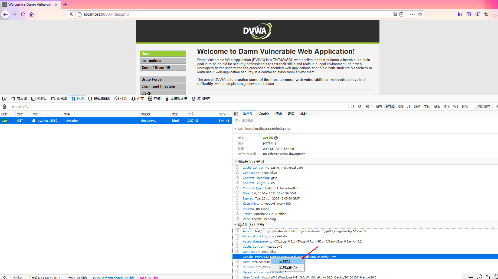
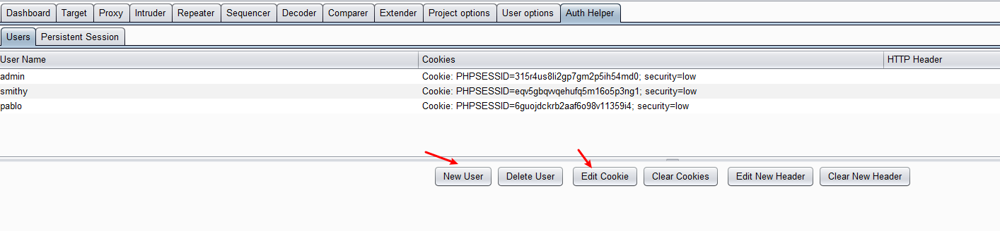
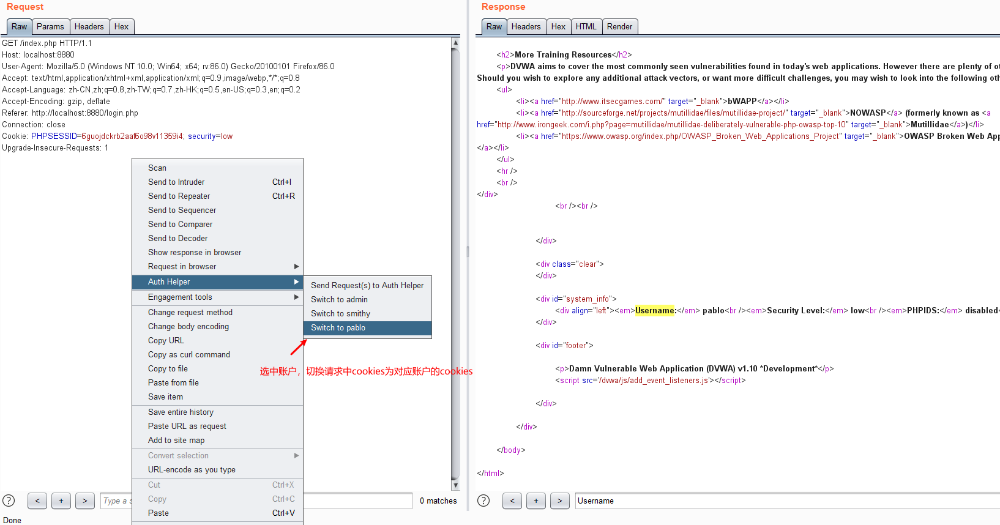
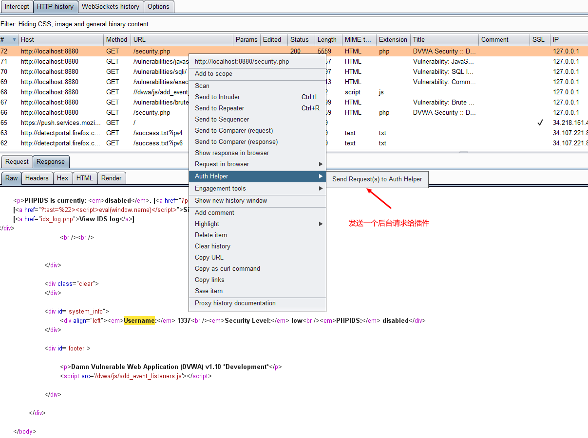
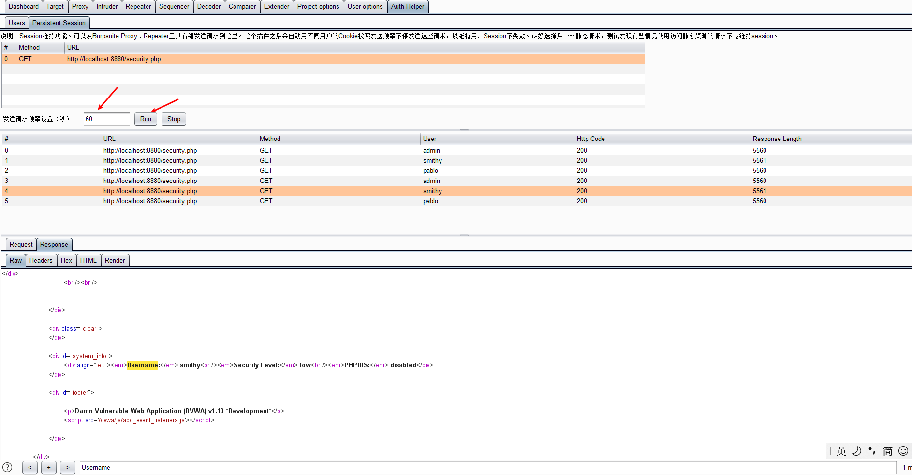
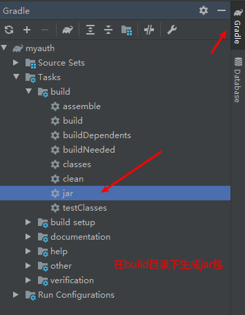
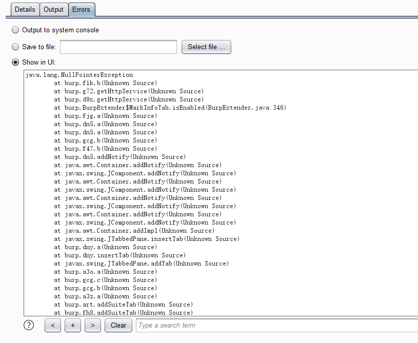

# AuthHelper
这个burpsuite插件用于辅助测试越权，主要有两个功能。功能一，在插件里添加用户及对应cookies后，可以在repeater、proxy中右键替换请求中用户cookies；功能二，在插件里设置网站后台请求、请求发送频率后，可维持多个测试用户cookies不失效，无需在测试过程中频繁登录网站获取其他账户cookies。这个插件的开发借鉴参考了AuthMatrix，按照个人测试越权漏洞的习惯进行了改造。

## 插件使用

### 功能一、右键替换请求cookies

1. 登录测试网站后，使用浏览器开发者工具复制请求中的cookies。

2. 在插件中添加账户名称，绑定cookies。关闭浏览器（直接叉掉），重新打开登录页面，登录其他账户。重复上述操作，可以添加多个账户的cookies。

3、替换请求cookies。

### 功能二、session有效期维持
有些网站登录之后一段时间不操作，session会失效。通过不停的发送请求给服务器，可以维持session不失效。
1. 发送后台请求给插件。

2. 根据session失效时间，设置请求发送频率，点击run，插件会自动使用不同用户的cookies来发送请求。

## 插件编译

## 说明
最好使用对后台的、非静态资源的请求来维持session不失效，如对php、jsp、do这种请求。有遇到过，不停对js文件发送请求来维持session，但依然会失效的情况。原因跟session超时退出机制有关。有一种机制是，登录成功后，服务端代码会在session中写入一个类似expire参数，参数值假设为30分钟的时间。后续收到请求，会先判断当前时间是否小于expire中的时间，如果是，更新expire值为30分钟后的时间；如果不是，判定session失效了。即使是在30分钟内访问静态文件，如js文件，由于不会触发更新expire参数值，所以30分钟后session依然会失效。

这个插件在我一台笔记本上安装正常，在burpsuite community上安装也正常，但在另外一台笔记本上安装时会报如下错误。水平有限找不到原因，简单测试一番也不影响使用，就不想弄了。

有其他bug，可以发我邮箱ox6d61747466616e@126.com。